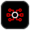

# Frontend Assets Icon Components

This file documents the generated React icon components and their usage with ScalprumComponent for dynamic loading.

## Usage

These components are designed to be used with ScalprumComponent for dynamic loading. They are not imported directly.

### Without PatternFly Wrapper (Preserves original SVG dimensions)
```tsx
<ScalprumComponent 
  scope="frontendAssets" 
  module="./ComponentName" 
  svgProps={{width: 50, height: 50}} 
/>
```

### With PatternFly Wrapper (Uses PatternFly Icon styling)
```tsx
<ScalprumComponent 
  scope="frontendAssets" 
  module="./ComponentName" 
  pfIconWrapper={true} 
  iconProps={{size: "lg"}} 
/>
```

### Combined Usage
```tsx
<ScalprumComponent 
  scope="frontendAssets" 
  module="./ComponentName" 
  pfIconWrapper={true}
  iconProps={{size: "md"}}
  svgProps={{className: "custom-icon-class"}} 
/>
```

## Props

All components accept the following props through ScalprumComponent:

- `pfIconWrapper?: boolean` - Whether to wrap the SVG in PatternFly's Icon component
- `iconProps?: IconComponentProps` - Props to pass to the PatternFly Icon wrapper (only used when pfIconWrapper is true)
- `svgProps?: React.SVGProps<SVGSVGElement>` - Props to pass directly to the SVG element

## Module Federation

These components are exposed through module federation with the scope `frontendAssets`. Each component can be loaded using its module name (e.g., `./ComponentName`).

## Component Mappings

| Preview | Component Name | Original SVG Name | Source SVG Path | Generated TSX Path |
|---|---|---|---|---|
|  | `PartnersAwsIcon` | `aws.svg` | `/partners/aws.svg` | `/partners/aws.tsx` |
|  | `TechnologyIcons3scaleApiManagementIcon` | `3scale-api-management.svg` | `/technology-icons/3scale-api-management.svg` | `/technology-icons/3scale-api-management.tsx` |
|  | `TechnologyIconsAcmForKubernetesIcon` | `acm-for-kubernetes.svg` | `/technology-icons/acm-for-kubernetes.svg` | `/technology-icons/acm-for-kubernetes.tsx` |
|  | `TechnologyIconsAcsIcon` | `acs.svg` | `/technology-icons/acs.svg` | `/technology-icons/acs.tsx` |
|  | `TechnologyIconsAmqIcon` | `amq.svg` | `/technology-icons/amq.svg` | `/technology-icons/amq.tsx` |
|  | `TechnologyIconsAnsibleAutomationHubHostedIcon` | `ansible-automation-hub-hosted.svg` | `/technology-icons/ansible-automation-hub-hosted.svg` | `/technology-icons/ansible-automation-hub-hosted.tsx` |
|  | `TechnologyIconsAnsibleAutomationPlatformOperatorIcon` | `ansible-automation-platform-operator.svg` | `/technology-icons/ansible-automation-platform-operator.svg` | `/technology-icons/ansible-automation-platform-operator.tsx` |
|  | `TechnologyIconsAnsibleContentCollectionsIcon` | `ansible-content-collections.svg` | `/technology-icons/ansible-content-collections.svg` | `/technology-icons/ansible-content-collections.tsx` |
|  | `TechnologyIconsAnsibleContentToolsIcon` | `ansible-content-tools.svg` | `/technology-icons/ansible-content-tools.svg` | `/technology-icons/ansible-content-tools.tsx` |
|  | `TechnologyIconsAnsibleCoreIcon` | `ansible-core.svg` | `/technology-icons/ansible-core.svg` | `/technology-icons/ansible-core.tsx` |
|  | `TechnologyIconsAnsibleIcon` | `ansible.svg` | `/technology-icons/ansible.svg` | `/technology-icons/ansible.tsx` |
|  | `TechnologyIconsAnsiblePlaybooksIcon` | `ansible-playbooks.svg` | `/technology-icons/ansible-playbooks.svg` | `/technology-icons/ansible-playbooks.tsx` |
|  | `TechnologyIconsAnsibleRulebookIcon` | `ansible-rulebook.svg` | `/technology-icons/ansible-rulebook.svg` | `/technology-icons/ansible-rulebook.tsx` |
|  | `TechnologyIconsApacheKafkaIcon` | `apache-kafka.svg` | `/technology-icons/apache-kafka.svg` | `/technology-icons/apache-kafka.tsx` |
|  | `TechnologyIconsAppServicesIcon` | `app-services.svg` | `/technology-icons/app-services.svg` | `/technology-icons/app-services.tsx` |
|  | `TechnologyIconsAutomationContentNavigatorIcon` | `automation-content-navigator.svg` | `/technology-icons/automation-content-navigator.svg` | `/technology-icons/automation-content-navigator.tsx` |
|  | `TechnologyIconsAutomationControllerIcon` | `automation-controller.svg` | `/technology-icons/automation-controller.svg` | `/technology-icons/automation-controller.tsx` |
|  | `TechnologyIconsAutomationExecutionEnvironmentsIcon` | `automation-execution-environments.svg` | `/technology-icons/automation-execution-environments.svg` | `/technology-icons/automation-execution-environments.tsx` |
|  | `TechnologyIconsAutomationMeshIcon` | `automation-mesh.svg` | `/technology-icons/automation-mesh.svg` | `/technology-icons/automation-mesh.tsx` |
|  | `TechnologyIconsBuildOfApacheCamelIcon` | `build-of-apache-camel.svg` | `/technology-icons/build-of-apache-camel.svg` | `/technology-icons/build-of-apache-camel.tsx` |
|  | `TechnologyIconsBuildOfOpenTelemetryIcon` | `build-of-open-telemetry.svg` | `/technology-icons/build-of-open-telemetry.svg` | `/technology-icons/build-of-open-telemetry.tsx` |
|  | `TechnologyIconsBuildOfQuarkusIcon` | `build-of-quarkus.svg` | `/technology-icons/build-of-quarkus.svg` | `/technology-icons/build-of-quarkus.tsx` |
|  | `TechnologyIconsBuildsForOpenshiftIcon` | `builds-for-openshift.svg` | `/technology-icons/builds-for-openshift.svg` | `/technology-icons/builds-for-openshift.tsx` |
|  | `TechnologyIconsComplianceOperatorIcon` | `compliance-operator.svg` | `/technology-icons/compliance-operator.svg` | `/technology-icons/compliance-operator.tsx` |
|  | `TechnologyIconsCustomMetricsAutoscalerIcon` | `custom-metrics-autoscaler.svg` | `/technology-icons/custom-metrics-autoscaler.svg` | `/technology-icons/custom-metrics-autoscaler.tsx` |
|  | `TechnologyIconsDataScienceIcon` | `data-science.svg` | `/technology-icons/data-science.svg` | `/technology-icons/data-science.tsx` |
|  | `TechnologyIconsDependencyAnalyticsIcon` | `dependency-analytics.svg` | `/technology-icons/dependency-analytics.svg` | `/technology-icons/dependency-analytics.tsx` |
|  | `TechnologyIconsDeveloperHubIcon` | `developer-hub.svg` | `/technology-icons/developer-hub.svg` | `/technology-icons/developer-hub.tsx` |
|  | `TechnologyIconsDeviceEdgeIcon` | `device-edge.svg` | `/technology-icons/device-edge.svg` | `/technology-icons/device-edge.tsx` |
|  | `TechnologyIconsDistributedTracingIcon` | `distributed-tracing.svg` | `/technology-icons/distributed-tracing.svg` | `/technology-icons/distributed-tracing.tsx` |
|  | `TechnologyIconsEdgeIcon` | `edge.svg` | `/technology-icons/edge.svg` | `/technology-icons/edge.tsx` |
|  | `TechnologyIconsEventDrivenAnsibleControllerIcon` | `event-driven-ansible-controller.svg` | `/technology-icons/event-driven-ansible-controller.svg` | `/technology-icons/event-driven-ansible-controller.tsx` |
|  | `TechnologyIconsExecutionEnvironmentBuilderIcon` | `execution-environment-builder.svg` | `/technology-icons/execution-environment-builder.svg` | `/technology-icons/execution-environment-builder.tsx` |
|  | `TechnologyIconsFileIntegrityOperatorIcon` | `file-integrity-operator.svg` | `/technology-icons/file-integrity-operator.svg` | `/technology-icons/file-integrity-operator.tsx` |
|  | `TechnologyIconsIamIcon` | `iam.svg` | `/technology-icons/iam.svg` | `/technology-icons/iam.tsx` |
|  | `TechnologyIconsImageModeIcon` | `image-mode.svg` | `/technology-icons/image-mode.svg` | `/technology-icons/image-mode.tsx` |
|  | `TechnologyIconsInfraredIntelligenceFeatureIcon` | `infrared-intelligence-feature.svg` | `/technology-icons/infrared-intelligence-feature.svg` | `/technology-icons/infrared-intelligence-feature.tsx` |
|  | `TechnologyIconsInfrastructureOperatorForOpenshiftIcon` | `infrastructure-operator-for-openshift.svg` | `/technology-icons/infrastructure-operator-for-openshift.svg` | `/technology-icons/infrastructure-operator-for-openshift.tsx` |
|  | `TechnologyIconsInsightsIcon` | `insights.svg` | `/technology-icons/insights.svg` | `/technology-icons/insights.tsx` |
|  | `TechnologyIconsIntegrationsIcon` | `integrations.svg` | `/technology-icons/integrations.svg` | `/technology-icons/integrations.tsx` |
|  | `TechnologyIconsJbossEapIcon` | `jboss-eap.svg` | `/technology-icons/jboss-eap.svg` | `/technology-icons/jboss-eap.tsx` |
|  | `TechnologyIconsLearningResourcesIcon` | `learning-resources.svg` | `/technology-icons/learning-resources.svg` | `/technology-icons/learning-resources.tsx` |
|  | `TechnologyIconsLightspeedIcon` | `lightspeed.svg` | `/technology-icons/lightspeed.svg` | `/technology-icons/lightspeed.tsx` |
|  | `TechnologyIconsMigrationToolkitIcon` | `migration-toolkit.svg` | `/technology-icons/migration-toolkit.svg` | `/technology-icons/migration-toolkit.tsx` |
|  | `TechnologyIconsNotificationsIcon` | `notifications.svg` | `/technology-icons/notifications.svg` | `/technology-icons/notifications.tsx` |
|  | `TechnologyIconsOpenshiftAiIcon` | `openshift-ai.svg` | `/technology-icons/openshift-ai.svg` | `/technology-icons/openshift-ai.tsx` |
|  | `TechnologyIconsOpenshiftApiDesignerIcon` | `openshift-api-designer.svg` | `/technology-icons/openshift-api-designer.svg` | `/technology-icons/openshift-api-designer.tsx` |
|  | `TechnologyIconsOpenshiftConnectorsIcon` | `openshift-connectors.svg` | `/technology-icons/openshift-connectors.svg` | `/technology-icons/openshift-connectors.tsx` |
|  | `TechnologyIconsOpenshiftDatabaseAccessIcon` | `openshift-database-access.svg` | `/technology-icons/openshift-database-access.svg` | `/technology-icons/openshift-database-access.tsx` |
|  | `TechnologyIconsOpenshiftDevSpacesIcon` | `openshift-dev-spaces.svg` | `/technology-icons/openshift-dev-spaces.svg` | `/technology-icons/openshift-dev-spaces.tsx` |
|  | `TechnologyIconsOpenshiftGitOpsIcon` | `openshift-git-ops.svg` | `/technology-icons/openshift-git-ops.svg` | `/technology-icons/openshift-git-ops.tsx` |
|  | `TechnologyIconsOpenshiftIcon` | `openshift.svg` | `/technology-icons/openshift.svg` | `/technology-icons/openshift.tsx` |
|  | `TechnologyIconsOpenshiftPipelinesIcon` | `openshift-pipelines.svg` | `/technology-icons/openshift-pipelines.svg` | `/technology-icons/openshift-pipelines.tsx` |
|  | `TechnologyIconsOpenshiftSandboxedContainersIcon` | `openshift-sandboxed-containers.svg` | `/technology-icons/openshift-sandboxed-containers.svg` | `/technology-icons/openshift-sandboxed-containers.tsx` |
|  | `TechnologyIconsOpenshiftServerlessIcon` | `openshift-serverless.svg` | `/technology-icons/openshift-serverless.svg` | `/technology-icons/openshift-serverless.tsx` |
|  | `TechnologyIconsOpenshiftServiceMeshIcon` | `openshift-service-mesh.svg` | `/technology-icons/openshift-service-mesh.svg` | `/technology-icons/openshift-service-mesh.tsx` |
|  | `TechnologyIconsOpenshiftServiceRegistryIcon` | `openshift-service-registry.svg` | `/technology-icons/openshift-service-registry.svg` | `/technology-icons/openshift-service-registry.tsx` |
|  | `TechnologyIconsOpenshiftSmartEventsIcon` | `openshift-smart-events.svg` | `/technology-icons/openshift-smart-events.svg` | `/technology-icons/openshift-smart-events.tsx` |
|  | `TechnologyIconsOpenshiftVirtualizationIcon` | `openshift-virtualization.svg` | `/technology-icons/openshift-virtualization.svg` | `/technology-icons/openshift-virtualization.tsx` |
|  | `TechnologyIconsOpenstackPlatformIcon` | `openstack-platform.svg` | `/technology-icons/openstack-platform.svg` | `/technology-icons/openstack-platform.tsx` |
|  | `TechnologyIconsPlaceholder1Icon` | `placeholder-1.svg` | `/technology-icons/placeholder-1.svg` | `/technology-icons/placeholder-1.tsx` |
|  | `TechnologyIconsPlaceholder2Icon` | `placeholder-2.svg` | `/technology-icons/placeholder-2.svg` | `/technology-icons/placeholder-2.tsx` |
|  | `TechnologyIconsPrivateAutomationHubIcon` | `private-automation-hub.svg` | `/technology-icons/private-automation-hub.svg` | `/technology-icons/private-automation-hub.tsx` |
|  | `TechnologyIconsQuayIoIcon` | `quay-io.svg` | `/technology-icons/quay-io.svg` | `/technology-icons/quay-io.tsx` |
|  | `TechnologyIconsRhelIcon` | `rhel.svg` | `/technology-icons/rhel.svg` | `/technology-icons/rhel.tsx` |
|  | `TechnologyIconsRhelLinuxForWorkstationsIcon` | `rhel-linux-for-workstations.svg` | `/technology-icons/rhel-linux-for-workstations.svg` | `/technology-icons/rhel-linux-for-workstations.tsx` |
|  | `TechnologyIconsRhIcon` | `rh.svg` | `/technology-icons/rh.svg` | `/technology-icons/rh.tsx` |
|  | `TechnologyIconsRhtapIcon` | `rhtap.svg` | `/technology-icons/rhtap.svg` | `/technology-icons/rhtap.tsx` |
|  | `TechnologyIconsRuntimesIcon` | `runtimes.svg` | `/technology-icons/runtimes.svg` | `/technology-icons/runtimes.tsx` |
|  | `TechnologyIconsSatelliteIcon` | `satellite.svg` | `/technology-icons/satellite.svg` | `/technology-icons/satellite.tsx` |
|  | `TechnologyIconsSecurityProfileOperatorIcon` | `security-profile-operator.svg` | `/technology-icons/security-profile-operator.svg` | `/technology-icons/security-profile-operator.tsx` |
|  | `TechnologyIconsSettingsIcon` | `settings.svg` | `/technology-icons/settings.svg` | `/technology-icons/settings.tsx` |
|  | `TechnologyIconsSingleSignOnIcon` | `single-sign-on.svg` | `/technology-icons/single-sign-on.svg` | `/technology-icons/single-sign-on.tsx` |
|  | `TechnologyIconsSubscriptionsIcon` | `subscriptions.svg` | `/technology-icons/subscriptions.svg` | `/technology-icons/subscriptions.tsx` |
|  | `TechnologyIconsTrustedArtifactIcon` | `trusted-artifact.svg` | `/technology-icons/trusted-artifact.svg` | `/technology-icons/trusted-artifact.tsx` |
|  | `TechnologyIconsTrustedArtifactSignerIcon` | `trusted-artifact-signer.svg` | `/technology-icons/trusted-artifact-signer.svg` | `/technology-icons/trusted-artifact-signer.tsx` |
|  | `TechnologyIconsTrustedContent1Icon` | `trusted-content-1.svg` | `/technology-icons/trusted-content-1.svg` | `/technology-icons/trusted-content-1.tsx` |
|  | `TechnologyIconsTrustedContent2Icon` | `trusted-content-2.svg` | `/technology-icons/trusted-content-2.svg` | `/technology-icons/trusted-content-2.tsx` |

## Generated Components

Total components generated: 78
