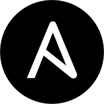
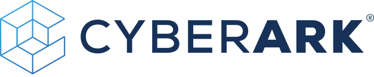
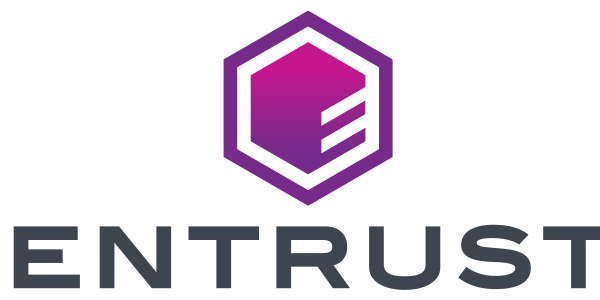
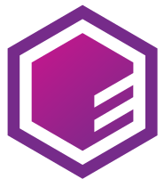
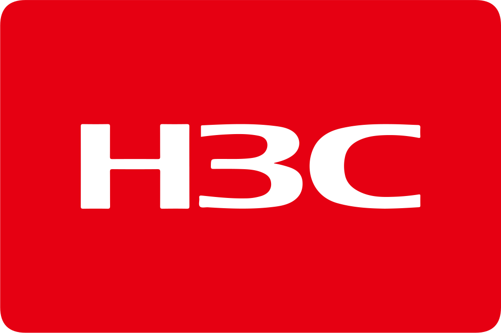
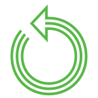
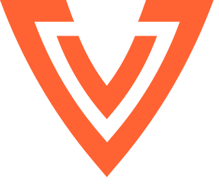

# Frontend Assets Icon Components

This file documents the generated React icon components and their usage with ScalprumComponent for dynamic loading.

## Usage

These components are designed to be used with ScalprumComponent for dynamic loading. They are not imported directly.

### Without PatternFly Wrapper (Preserves original SVG dimensions)
```tsx
<ScalprumComponent 
  scope="frontendAssets" 
  module="./IconComponentName" 
  svgProps={{width: 50, height: 50}} 
/>
```

### With PatternFly Wrapper (Uses PatternFly Icon styling)
```tsx
<ScalprumComponent 
  scope="frontendAssets" 
  module="./IconComponentName" 
  pfIconWrapper={true} 
  iconProps={{size: "lg"}} 
/>
```

### Combined Usage
```tsx
<ScalprumComponent 
  scope="frontendAssets" 
  module="./IconComponentName" 
  pfIconWrapper={true}
  iconProps={{size: "md"}}
  svgProps={{className: "custom-icon-class"}} 
/>
```

## Props

All components accept the following props through ScalprumComponent:

- `pfIconWrapper?: boolean` - Whether to wrap the SVG in PatternFly's Icon component
- `iconProps?: IconComponentProps` - Props to pass to the PatternFly Icon wrapper (only used when pfIconWrapper is true)
- `svgProps?: React.SVGProps<SVGSVGElement>` - Props to pass directly to the SVG element

## Module Federation

These components are exposed through module federation with the scope `frontendAssets`. Each component can be loaded using its module name (e.g., `./ComponentName`).

## Component Mappings

| Preview | Component Name | Original SVG Name | Source SVG Path | Generated TSX Path |
|---|---|---|---|---|
|  | `A10NetworksIcon` | `a10-networks.svg` | `/partners-icons/a10-networks.svg` | `/partners-icons/a10-networks.tsx` |
|  | `AcmForKubernetesIcon` | `acm-for-kubernetes.svg` | `/technology-icons/acm-for-kubernetes.svg` | `/technology-icons/acm-for-kubernetes.tsx` |
|  | `AcsIcon` | `acs.svg` | `/technology-icons/acs.svg` | `/technology-icons/acs.tsx` |
|  | `AmazonIcon` | `amazon.svg` | `/partners-icons/amazon.svg` | `/partners-icons/amazon.tsx` |
|  | `AmqIcon` | `amq.svg` | `/technology-icons/amq.svg` | `/technology-icons/amq.tsx` |
|  | `AnsibleAutomationHubHostedIcon` | `ansible-automation-hub-hosted.svg` | `/technology-icons/ansible-automation-hub-hosted.svg` | `/technology-icons/ansible-automation-hub-hosted.tsx` |
|  | `AnsibleAutomationPlatformOperatorIcon` | `ansible-automation-platform-operator.svg` | `/technology-icons/ansible-automation-platform-operator.svg` | `/technology-icons/ansible-automation-platform-operator.tsx` |
|  | `AnsibleCommunityMarkIcon` | `ansible-community-mark.svg` | `/technology-icons/ansible-community-mark.svg` | `/technology-icons/ansible-community-mark.tsx` |
|  | `AnsibleContentCollectionsIcon` | `ansible-content-collections.svg` | `/technology-icons/ansible-content-collections.svg` | `/technology-icons/ansible-content-collections.tsx` |
|  | `AnsibleContentToolsIcon` | `ansible-content-tools.svg` | `/technology-icons/ansible-content-tools.svg` | `/technology-icons/ansible-content-tools.tsx` |
|  | `AnsibleCoreIcon` | `ansible-core.svg` | `/technology-icons/ansible-core.svg` | `/technology-icons/ansible-core.tsx` |
|  | `AnsibleIcon` | `ansible.svg` | `/technology-icons/ansible.svg` | `/technology-icons/ansible.tsx` |
|  | `AnsiblePlaybooksIcon` | `ansible-playbooks.svg` | `/technology-icons/ansible-playbooks.svg` | `/technology-icons/ansible-playbooks.tsx` |
|  | `AnsibleRulebookIcon` | `ansible-rulebook.svg` | `/technology-icons/ansible-rulebook.svg` | `/technology-icons/ansible-rulebook.tsx` |
|  | `AnsibleTowerIcon` | `ansible-tower.svg` | `/technology-icons/ansible-tower.svg` | `/technology-icons/ansible-tower.tsx` |
|  | `AnsibleTowerRedIcon` | `ansible-tower-red.svg` | `/technology-icons/ansible-tower-red.svg` | `/technology-icons/ansible-tower-red.tsx` |
|  | `ApacheKafkaIcon` | `apache-kafka.svg` | `/technology-icons/apache-kafka.svg` | `/technology-icons/apache-kafka.tsx` |
|  | `AppServicesIcon` | `app-services.svg` | `/technology-icons/app-services.svg` | `/technology-icons/app-services.tsx` |
|  | `AristaIcon` | `arista.svg` | `/partners-icons/arista.svg` | `/partners-icons/arista.tsx` |
|  | `ArubaNetworksIcon` | `aruba-networks.svg` | `/partners-icons/aruba-networks.svg` | `/partners-icons/aruba-networks.tsx` |
|  | `AutomationContentNavigatorIcon` | `automation-content-navigator.svg` | `/technology-icons/automation-content-navigator.svg` | `/technology-icons/automation-content-navigator.tsx` |
|  | `AutomationControllerIcon` | `automation-controller.svg` | `/technology-icons/automation-controller.svg` | `/technology-icons/automation-controller.tsx` |
|  | `AutomationExecutionEnvironmentsIcon` | `automation-execution-environments.svg` | `/technology-icons/automation-execution-environments.svg` | `/technology-icons/automation-execution-environments.tsx` |
|  | `AutomationMeshIcon` | `automation-mesh.svg` | `/technology-icons/automation-mesh.svg` | `/technology-icons/automation-mesh.tsx` |
|  | `AvantraIcon` | `Avantra.svg` | `/partners-icons/Avantra.svg` | `/partners-icons/Avantra.tsx` |
|  | `AwsIcon` | `aws.svg` | `/partners-icons/aws.svg` | `/partners-icons/aws.tsx` |
|  | `AwsLogomarkIcon` | `aws-logomark.svg` | `/partners-icons/aws-logomark.svg` | `/partners-icons/aws-logomark.tsx` |
|  | `AwsLongIcon` | `aws-long.svg` | `/partners-icons/aws-long.svg` | `/partners-icons/aws-long.tsx` |
|  | `BigpandaioIcon` | `bigpandaio.svg` | `/partners-icons/bigpandaio.svg` | `/partners-icons/bigpandaio.tsx` |
|  | `BigpandaioLogomarkIcon` | `bigpandaio-logomark.svg` | `/partners-icons/bigpandaio-logomark.svg` | `/partners-icons/bigpandaio-logomark.tsx` |
|  | `BuildOfApacheCamelIcon` | `build-of-apache-camel.svg` | `/technology-icons/build-of-apache-camel.svg` | `/technology-icons/build-of-apache-camel.tsx` |
|  | `BuildOfOpenTelemetryIcon` | `build-of-open-telemetry.svg` | `/technology-icons/build-of-open-telemetry.svg` | `/technology-icons/build-of-open-telemetry.tsx` |
|  | `BuildOfQuarkusIcon` | `build-of-quarkus.svg` | `/technology-icons/build-of-quarkus.svg` | `/technology-icons/build-of-quarkus.tsx` |
|  | `BuildsForOpenshiftIcon` | `builds-for-openshift.svg` | `/technology-icons/builds-for-openshift.svg` | `/technology-icons/builds-for-openshift.tsx` |
|  | `CheckPointTechnologiesIcon` | `check-point-technologies.svg` | `/partners-icons/check-point-technologies.svg` | `/partners-icons/check-point-technologies.tsx` |
|  | `ChocolateyIcon` | `chocolatey.svg` | `/partners-icons/chocolatey.svg` | `/partners-icons/chocolatey.tsx` |
|  | `CitrixIcon` | `citrix.svg` | `/partners-icons/citrix.svg` | `/partners-icons/citrix.tsx` |
|  | `CohesityIcon` | `cohesity.svg` | `/partners-icons/cohesity.svg` | `/partners-icons/cohesity.tsx` |
|  | `ComplianceOperatorIcon` | `compliance-operator.svg` | `/technology-icons/compliance-operator.svg` | `/technology-icons/compliance-operator.tsx` |
|  | `ConfluentIcon` | `confluent.svg` | `/partners-icons/confluent.svg` | `/partners-icons/confluent.tsx` |
|  | `ConfluentLogomarkIcon` | `confluent-logomark.svg` | `/partners-icons/confluent-logomark.svg` | `/partners-icons/confluent-logomark.tsx` |
|  | `Crowdstrike2Icon` | `crowdstrike-2.svg` | `/partners-icons/crowdstrike-2.svg` | `/partners-icons/crowdstrike-2.tsx` |
|  | `CrowdstrikeIcon` | `crowdstrike.svg` | `/partners-icons/crowdstrike.svg` | `/partners-icons/crowdstrike.tsx` |
|  | `CustomMetricsAutoscalerIcon` | `custom-metrics-autoscaler.svg` | `/technology-icons/custom-metrics-autoscaler.svg` | `/technology-icons/custom-metrics-autoscaler.tsx` |
|  | `CyberarkIcon` | `cyberark.svg` | `/partners-icons/cyberark.svg` | `/partners-icons/cyberark.tsx` |
|  | `CyberarkLogomarkIcon` | `cyberark-logomark.svg` | `/partners-icons/cyberark-logomark.svg` | `/partners-icons/cyberark-logomark.tsx` |
|  | `DatadogIcon` | `datadog.svg` | `/partners-icons/datadog.svg` | `/partners-icons/datadog.tsx` |
|  | `DatadogLogomarkIcon` | `datadog-logomark.svg` | `/partners-icons/datadog-logomark.svg` | `/partners-icons/datadog-logomark.tsx` |
|  | `DataScienceIcon` | `data-science.svg` | `/technology-icons/data-science.svg` | `/technology-icons/data-science.tsx` |
|  | `DelineaIcon` | `delinea.svg` | `/partners-icons/delinea.svg` | `/partners-icons/delinea.tsx` |
|  | `DelineaLogomarkIcon` | `delinea-logomark.svg` | `/partners-icons/delinea-logomark.svg` | `/partners-icons/delinea-logomark.tsx` |
|  | `DellTechnologies2Icon` | `dell-technologies-2.svg` | `/partners-icons/dell-technologies-2.svg` | `/partners-icons/dell-technologies-2.tsx` |
|  | `DellTechnologiesIcon` | `dell-technologies.svg` | `/partners-icons/dell-technologies.svg` | `/partners-icons/dell-technologies.tsx` |
|  | `DependencyAnalyticsIcon` | `dependency-analytics.svg` | `/technology-icons/dependency-analytics.svg` | `/technology-icons/dependency-analytics.tsx` |
|  | `DeveloperHubIcon` | `developer-hub.svg` | `/technology-icons/developer-hub.svg` | `/technology-icons/developer-hub.tsx` |
|  | `DeviceEdgeIcon` | `device-edge.svg` | `/technology-icons/device-edge.svg` | `/technology-icons/device-edge.tsx` |
|  | `DistributedTracingIcon` | `distributed-tracing.svg` | `/technology-icons/distributed-tracing.svg` | `/technology-icons/distributed-tracing.tsx` |
|  | `DynatraceIcon` | `dynatrace.svg` | `/partners-icons/dynatrace.svg` | `/partners-icons/dynatrace.tsx` |
|  | `DynatraceLogomarkIcon` | `dynatrace-logomark.svg` | `/partners-icons/dynatrace-logomark.svg` | `/partners-icons/dynatrace-logomark.tsx` |
|  | `EdgeIcon` | `edge.svg` | `/technology-icons/edge.svg` | `/technology-icons/edge.tsx` |
|  | `EntrustIcon` | `entrust.svg` | `/partners-icons/entrust.svg` | `/partners-icons/entrust.tsx` |
|  | `EntrustLogomarkIcon` | `entrust-logomark.svg` | `/partners-icons/entrust-logomark.svg` | `/partners-icons/entrust-logomark.tsx` |
|  | `EventDrivenAnsibleControllerIcon` | `event-driven-ansible-controller.svg` | `/technology-icons/event-driven-ansible-controller.svg` | `/technology-icons/event-driven-ansible-controller.tsx` |
|  | `ExecutionEnvironmentBuilderIcon` | `execution-environment-builder.svg` | `/technology-icons/execution-environment-builder.svg` | `/technology-icons/execution-environment-builder.tsx` |
|  | `F5Icon` | `f5.svg` | `/partners-icons/f5.svg` | `/partners-icons/f5.tsx` |
|  | `FileIntegrityOperatorIcon` | `file-integrity-operator.svg` | `/technology-icons/file-integrity-operator.svg` | `/technology-icons/file-integrity-operator.tsx` |
|  | `FortinetIcon` | `fortinet.svg` | `/partners-icons/fortinet.svg` | `/partners-icons/fortinet.tsx` |
|  | `FortinetLogomarkIcon` | `fortinet-logomark.svg` | `/partners-icons/fortinet-logomark.svg` | `/partners-icons/fortinet-logomark.tsx` |
|  | `FrroutingIcon` | `frrouting.svg` | `/partners-icons/frrouting.svg` | `/partners-icons/frrouting.tsx` |
|  | `GoogleChatIcon` | `google-chat.svg` | `/partners-icons/google-chat.svg` | `/partners-icons/google-chat.tsx` |
|  | `GoogleCloudIcon` | `google-cloud.svg` | `/partners-icons/google-cloud.svg` | `/partners-icons/google-cloud.tsx` |
|  | `GoogleCloudLogomarkIcon` | `google-cloud-logomark.svg` | `/partners-icons/google-cloud-logomark.svg` | `/partners-icons/google-cloud-logomark.tsx` |
|  | `GoogleCloudShortIcon` | `google-cloud-short.svg` | `/partners-icons/google-cloud-short.svg` | `/partners-icons/google-cloud-short.tsx` |
|  | `H3c1Icon` | `h3c-1.svg` | `/partners-icons/h3c-1.svg` | `/partners-icons/h3c-1.tsx` |
|  | `H3c2Icon` | `h3c-2.svg` | `/partners-icons/h3c-2.svg` | `/partners-icons/h3c-2.tsx` |
|  | `HpEnterprise2Icon` | `hp-enterprise-2.svg` | `/partners-icons/hp-enterprise-2.svg` | `/partners-icons/hp-enterprise-2.tsx` |
|  | `HpEnterpriseIcon` | `hp-enterprise.svg` | `/partners-icons/hp-enterprise.svg` | `/partners-icons/hp-enterprise.tsx` |
|  | `IamIcon` | `iam.svg` | `/technology-icons/iam.svg` | `/technology-icons/iam.tsx` |
|  | `IbmCloudIcon` | `ibm-cloud.svg` | `/partners-icons/ibm-cloud.svg` | `/partners-icons/ibm-cloud.tsx` |
|  | `IbmIcon` | `ibm.svg` | `/partners-icons/ibm.svg` | `/partners-icons/ibm.tsx` |
|  | `ImageModeIcon` | `image-mode.svg` | `/technology-icons/image-mode.svg` | `/technology-icons/image-mode.tsx` |
|  | `InfiidatIcon` | `infiidat.svg` | `/partners-icons/infiidat.svg` | `/partners-icons/infiidat.tsx` |
|  | `InfobloxIcon` | `infoblox.svg` | `/partners-icons/infoblox.svg` | `/partners-icons/infoblox.tsx` |
|  | `InfraredIntelligenceFeatureIcon` | `infrared-intelligence-feature.svg` | `/technology-icons/infrared-intelligence-feature.svg` | `/technology-icons/infrared-intelligence-feature.tsx` |
|  | `InfrastructureOperatorForOpenshiftIcon` | `infrastructure-operator-for-openshift.svg` | `/technology-icons/infrastructure-operator-for-openshift.svg` | `/technology-icons/infrastructure-operator-for-openshift.tsx` |
|  | `InsightsIcon` | `insights.svg` | `/technology-icons/insights.svg` | `/technology-icons/insights.tsx` |
|  | `InspurIcon` | `inspur.svg` | `/partners-icons/inspur.svg` | `/partners-icons/inspur.tsx` |
|  | `IntegrationsIcon` | `integrations.svg` | `/technology-icons/integrations.svg` | `/technology-icons/integrations.tsx` |
|  | `JbossEapIcon` | `jboss-eap.svg` | `/technology-icons/jboss-eap.svg` | `/technology-icons/jboss-eap.tsx` |
|  | `JuniperNetworksIcon` | `juniper-networks.svg` | `/partners-icons/juniper-networks.svg` | `/partners-icons/juniper-networks.tsx` |
|  | `KentikIcon` | `kentik.svg` | `/partners-icons/kentik.svg` | `/partners-icons/kentik.tsx` |
|  | `KentikLogomarkIcon` | `kentik-logomark.svg` | `/partners-icons/kentik-logomark.svg` | `/partners-icons/kentik-logomark.tsx` |
|  | `KongShortIcon` | `kong-short.svg` | `/partners-icons/kong-short.svg` | `/partners-icons/kong-short.tsx` |
|  | `LearningResourcesIcon` | `learning-resources.svg` | `/technology-icons/learning-resources.svg` | `/technology-icons/learning-resources.tsx` |
|  | `LightspeedIcon` | `lightspeed.svg` | `/technology-icons/lightspeed.svg` | `/technology-icons/lightspeed.tsx` |
|  | `LogoRedHatAStandardRGBIcon` | `Logo-Red_Hat-A-Standard-RGB.svg` | `/console-logos/Logo-Red_Hat-A-Standard-RGB.svg` | `/console-logos/Logo-Red_Hat-A-Standard-RGB.tsx` |
|  | `LogoRedHatHybridCloudConsoleABlackRGBIcon` | `Logo-Red_Hat-Hybrid_Cloud_Console-A-Black-RGB.svg` | `/console-logos/Logo-Red_Hat-Hybrid_Cloud_Console-A-Black-RGB.svg` | `/console-logos/Logo-Red_Hat-Hybrid_Cloud_Console-A-Black-RGB.tsx` |
|  | `LogoRedHatHybridCloudConsoleABlackRGBIcon` | `Logo-Red_Hat-Hybrid-Cloud-Console-A-Black-RGB.svg` | `/console-logos/Logo-Red_Hat-Hybrid-Cloud-Console-A-Black-RGB.svg` | `/console-logos/Logo-Red_Hat-Hybrid-Cloud-Console-A-Black-RGB.tsx` |
|  | `LogoRedHatHybridCloudConsoleARedRGBIcon` | `Logo-Red_Hat-Hybrid_Cloud_Console-A-Red-RGB.svg` | `/console-logos/Logo-Red_Hat-Hybrid_Cloud_Console-A-Red-RGB.svg` | `/console-logos/Logo-Red_Hat-Hybrid_Cloud_Console-A-Red-RGB.tsx` |
|  | `LogoRedHatHybridCloudConsoleARedRGBIcon` | `Logo-Red_Hat-Hybrid-Cloud-Console-A-Red-RGB.svg` | `/console-logos/Logo-Red_Hat-Hybrid-Cloud-Console-A-Red-RGB.svg` | `/console-logos/Logo-Red_Hat-Hybrid-Cloud-Console-A-Red-RGB.tsx` |
|  | `LogoRedHatHybridCloudConsoleAReverseRGBIcon` | `Logo-Red_Hat-Hybrid_Cloud_Console-A-Reverse-RGB.svg` | `/console-logos/Logo-Red_Hat-Hybrid_Cloud_Console-A-Reverse-RGB.svg` | `/console-logos/Logo-Red_Hat-Hybrid_Cloud_Console-A-Reverse-RGB.tsx` |
|  | `LogoRedHatHybridCloudConsoleAReverseRGBIcon` | `Logo-Red_Hat-Hybrid-Cloud-Console-A-Reverse-RGB.svg` | `/console-logos/Logo-Red_Hat-Hybrid-Cloud-Console-A-Reverse-RGB.svg` | `/console-logos/Logo-Red_Hat-Hybrid-Cloud-Console-A-Reverse-RGB.tsx` |
|  | `LogoRedHatHybridCloudConsoleAStandardRGBIcon` | `Logo-Red_Hat-Hybrid_Cloud_Console-A-Standard-RGB.svg` | `/console-logos/Logo-Red_Hat-Hybrid_Cloud_Console-A-Standard-RGB.svg` | `/console-logos/Logo-Red_Hat-Hybrid_Cloud_Console-A-Standard-RGB.tsx` |
|  | `LogoRedHatHybridCloudConsoleAStandardRGBIcon` | `Logo-Red_Hat-Hybrid-Cloud-Console-A-Standard-RGB.svg` | `/console-logos/Logo-Red_Hat-Hybrid-Cloud-Console-A-Standard-RGB.svg` | `/console-logos/Logo-Red_Hat-Hybrid-Cloud-Console-A-Standard-RGB.tsx` |
|  | `LogoRedHatHybridCloudConsoleAWhiteRGBIcon` | `Logo-Red_Hat-Hybrid_Cloud_Console-A-White-RGB.svg` | `/console-logos/Logo-Red_Hat-Hybrid_Cloud_Console-A-White-RGB.svg` | `/console-logos/Logo-Red_Hat-Hybrid_Cloud_Console-A-White-RGB.tsx` |
|  | `LogoRedHatHybridCloudConsoleAWhiteRGBIcon` | `Logo-Red_Hat-Hybrid-Cloud-Console-A-White-RGB.svg` | `/console-logos/Logo-Red_Hat-Hybrid-Cloud-Console-A-White-RGB.svg` | `/console-logos/Logo-Red_Hat-Hybrid-Cloud-Console-A-White-RGB.tsx` |
|  | `LogoRedHatHybridCloudConsoleBBlackRGBIcon` | `Logo-Red_Hat-Hybrid_Cloud_Console-B-Black-RGB.svg` | `/console-logos/Logo-Red_Hat-Hybrid_Cloud_Console-B-Black-RGB.svg` | `/console-logos/Logo-Red_Hat-Hybrid_Cloud_Console-B-Black-RGB.tsx` |
|  | `LogoRedHatHybridCloudConsoleBRedRGBIcon` | `Logo-Red_Hat-Hybrid_Cloud_Console-B-Red-RGB.svg` | `/console-logos/Logo-Red_Hat-Hybrid_Cloud_Console-B-Red-RGB.svg` | `/console-logos/Logo-Red_Hat-Hybrid_Cloud_Console-B-Red-RGB.tsx` |
|  | `LogoRedHatHybridCloudConsoleBReverseRGBIcon` | `Logo-Red_Hat-Hybrid_Cloud_Console-B-Reverse-RGB.svg` | `/console-logos/Logo-Red_Hat-Hybrid_Cloud_Console-B-Reverse-RGB.svg` | `/console-logos/Logo-Red_Hat-Hybrid_Cloud_Console-B-Reverse-RGB.tsx` |
|  | `LogoRedHatHybridCloudConsoleBStandardRGBIcon` | `Logo-Red_Hat-Hybrid_Cloud_Console-B-Standard-RGB.svg` | `/console-logos/Logo-Red_Hat-Hybrid_Cloud_Console-B-Standard-RGB.svg` | `/console-logos/Logo-Red_Hat-Hybrid_Cloud_Console-B-Standard-RGB.tsx` |
|  | `LogoRedHatHybridCloudConsoleBWhiteRGBIcon` | `Logo-Red_Hat-Hybrid_Cloud_Console-B-White-RGB.svg` | `/console-logos/Logo-Red_Hat-Hybrid_Cloud_Console-B-White-RGB.svg` | `/console-logos/Logo-Red_Hat-Hybrid_Cloud_Console-B-White-RGB.tsx` |
|  | `MailIcon` | `mail.svg` | `/patternfly-icons/mail.svg` | `/patternfly-icons/mail.tsx` |
|  | `MicrosoftAzureIcon` | `microsoft-azure.svg` | `/partners-icons/microsoft-azure.svg` | `/partners-icons/microsoft-azure.tsx` |
|  | `MicrosoftAzureLogomarkIcon` | `microsoft-azure-logomark.svg` | `/partners-icons/microsoft-azure-logomark.svg` | `/partners-icons/microsoft-azure-logomark.tsx` |
|  | `MicrosoftAzureShortIcon` | `microsoft-azure-short.svg` | `/partners-icons/microsoft-azure-short.svg` | `/partners-icons/microsoft-azure-short.tsx` |
|  | `MicrosoftIcon` | `microsoft.svg` | `/partners-icons/microsoft.svg` | `/partners-icons/microsoft.tsx` |
|  | `MicrosoftLogomarkIcon` | `microsoft-logomark.svg` | `/partners-icons/microsoft-logomark.svg` | `/partners-icons/microsoft-logomark.tsx` |
|  | `MicrosoftOfficeTeamsIcon` | `microsoft-office-teams.svg` | `/partners-icons/microsoft-office-teams.svg` | `/partners-icons/microsoft-office-teams.tsx` |
|  | `MicrosoftShortIcon` | `microsoft-short.svg` | `/partners-icons/microsoft-short.svg` | `/partners-icons/microsoft-short.tsx` |
|  | `MigrationsNamespaceIcon` | `migrations-namespace.svg` | `/technology-icons/migrations-namespace.svg` | `/technology-icons/migrations-namespace.tsx` |
|  | `MigrationToolkitIcon` | `migration-toolkit.svg` | `/technology-icons/migration-toolkit.svg` | `/technology-icons/migration-toolkit.tsx` |
|  | `NetappIcon` | `netapp.svg` | `/partners-icons/netapp.svg` | `/partners-icons/netapp.tsx` |
|  | `NetappLogomarkIcon` | `netapp-logomark.svg` | `/partners-icons/netapp-logomark.svg` | `/partners-icons/netapp-logomark.tsx` |
|  | `NetboxLabsIcon` | `netbox-labs.svg` | `/partners-icons/netbox-labs.svg` | `/partners-icons/netbox-labs.tsx` |
|  | `NetscalerIcon` | `netscaler.svg` | `/partners-icons/netscaler.svg` | `/partners-icons/netscaler.tsx` |
|  | `NetscalerLogomarkIcon` | `netscaler-logomark.svg` | `/partners-icons/netscaler-logomark.svg` | `/partners-icons/netscaler-logomark.tsx` |
|  | `NewRelicIcon` | `new-relic.svg` | `/partners-icons/new-relic.svg` | `/partners-icons/new-relic.tsx` |
|  | `NewRelicLogomarkIcon` | `new-relic-logomark.svg` | `/partners-icons/new-relic-logomark.svg` | `/partners-icons/new-relic-logomark.tsx` |
|  | `NginxIcon` | `nginx.svg` | `/partners-icons/nginx.svg` | `/partners-icons/nginx.tsx` |
|  | `NginxLogomarkIcon` | `nginx-logomark.svg` | `/partners-icons/nginx-logomark.svg` | `/partners-icons/nginx-logomark.tsx` |
|  | `NokiaIcon` | `nokia.svg` | `/partners-icons/nokia.svg` | `/partners-icons/nokia.tsx` |
|  | `NokiaLogomarkIcon` | `nokia-logomark.svg` | `/partners-icons/nokia-logomark.svg` | `/partners-icons/nokia-logomark.tsx` |
|  | `NotificationsIcon` | `notifications.svg` | `/technology-icons/notifications.svg` | `/technology-icons/notifications.tsx` |
|  | `NutanixIcon` | `nutanix.svg` | `/partners-icons/nutanix.svg` | `/partners-icons/nutanix.tsx` |
|  | `NutanixLogomarkIcon` | `nutanix-logomark.svg` | `/partners-icons/nutanix-logomark.svg` | `/partners-icons/nutanix-logomark.tsx` |
|  | `NvidiaIcon` | `Nvidia.svg` | `/partners-icons/Nvidia.svg` | `/partners-icons/Nvidia.tsx` |
|  | `OnePasswordIcon` | `one-password.svg` | `/partners-icons/one-password.svg` | `/partners-icons/one-password.tsx` |
|  | `Openshift2Icon` | `openshift-2.svg` | `/technology-icons/openshift-2.svg` | `/technology-icons/openshift-2.tsx` |
|  | `OpenshiftAiIcon` | `openshift-ai.svg` | `/technology-icons/openshift-ai.svg` | `/technology-icons/openshift-ai.tsx` |
|  | `OpenshiftApiDesignerIcon` | `openshift-api-designer.svg` | `/technology-icons/openshift-api-designer.svg` | `/technology-icons/openshift-api-designer.tsx` |
|  | `OpenshiftConnectorsIcon` | `openshift-connectors.svg` | `/technology-icons/openshift-connectors.svg` | `/technology-icons/openshift-connectors.tsx` |
|  | `OpenshiftDatabaseAccessIcon` | `openshift-database-access.svg` | `/technology-icons/openshift-database-access.svg` | `/technology-icons/openshift-database-access.tsx` |
|  | `OpenshiftDevSpacesIcon` | `openshift-dev-spaces.svg` | `/technology-icons/openshift-dev-spaces.svg` | `/technology-icons/openshift-dev-spaces.tsx` |
|  | `OpenshiftGitOpsIcon` | `openshift-git-ops.svg` | `/technology-icons/openshift-git-ops.svg` | `/technology-icons/openshift-git-ops.tsx` |
|  | `OpenshiftIcon` | `openshift.svg` | `/technology-icons/openshift.svg` | `/technology-icons/openshift.tsx` |
|  | `OpenshiftPipelinesIcon` | `openshift-pipelines.svg` | `/technology-icons/openshift-pipelines.svg` | `/technology-icons/openshift-pipelines.tsx` |
|  | `OpenshiftSandboxedContainersIcon` | `openshift-sandboxed-containers.svg` | `/technology-icons/openshift-sandboxed-containers.svg` | `/technology-icons/openshift-sandboxed-containers.tsx` |
|  | `OpenshiftServerlessIcon` | `openshift-serverless.svg` | `/technology-icons/openshift-serverless.svg` | `/technology-icons/openshift-serverless.tsx` |
|  | `OpenshiftServiceMeshIcon` | `openshift-service-mesh.svg` | `/technology-icons/openshift-service-mesh.svg` | `/technology-icons/openshift-service-mesh.tsx` |
|  | `OpenshiftServiceRegistryIcon` | `openshift-service-registry.svg` | `/technology-icons/openshift-service-registry.svg` | `/technology-icons/openshift-service-registry.tsx` |
|  | `OpenshiftSmartEventsIcon` | `openshift-smart-events.svg` | `/technology-icons/openshift-smart-events.svg` | `/technology-icons/openshift-smart-events.tsx` |
|  | `OpenshiftVirtualizationIcon` | `openshift-virtualization.svg` | `/technology-icons/openshift-virtualization.svg` | `/technology-icons/openshift-virtualization.tsx` |
|  | `OpenstackIcon` | `openstack.svg` | `/partners-icons/openstack.svg` | `/partners-icons/openstack.tsx` |
|  | `OpenstackPlatformIcon` | `openstack-platform.svg` | `/technology-icons/openstack-platform.svg` | `/technology-icons/openstack-platform.tsx` |
|  | `OpensvcIcon` | `opensvc.svg` | `/partners-icons/opensvc.svg` | `/partners-icons/opensvc.tsx` |
|  | `OpenVswitchIcon` | `open-vswitch.svg` | `/partners-icons/open-vswitch.svg` | `/partners-icons/open-vswitch.tsx` |
|  | `OracleCloudInfraStackedIcon` | `oracle-cloud-infra-stacked.svg` | `/partners-icons/oracle-cloud-infra-stacked.svg` | `/partners-icons/oracle-cloud-infra-stacked.tsx` |
|  | `OracleIcon` | `Oracle.svg` | `/partners-icons/Oracle.svg` | `/partners-icons/Oracle.tsx` |
|  | `OracleShortIcon` | `oracle-short.svg` | `/partners-icons/oracle-short.svg` | `/partners-icons/oracle-short.tsx` |
|  | `OsMigrateIcon` | `os-migrate.svg` | `/technology-icons/os-migrate.svg` | `/technology-icons/os-migrate.tsx` |
|  | `OvirtIcon` | `ovirt.svg` | `/partners-icons/ovirt.svg` | `/partners-icons/ovirt.tsx` |
|  | `PagerdutyIcon` | `pagerduty.svg` | `/partners-icons/pagerduty.svg` | `/partners-icons/pagerduty.tsx` |
|  | `PagerdutyShortIcon` | `pagerduty-short.svg` | `/partners-icons/pagerduty-short.svg` | `/partners-icons/pagerduty-short.tsx` |
|  | `PaloAltoNetworksIcon` | `palo-alto-networks.svg` | `/partners-icons/palo-alto-networks.svg` | `/partners-icons/palo-alto-networks.tsx` |
|  | `PaloAltoNetworksLogomarkIcon` | `palo-alto-networks-logomark.svg` | `/partners-icons/palo-alto-networks-logomark.svg` | `/partners-icons/palo-alto-networks-logomark.tsx` |
|  | `PhoenixNapIcon` | `phoenix-nap.svg` | `/partners-icons/phoenix-nap.svg` | `/partners-icons/phoenix-nap.tsx` |
|  | `PhoenixNapLogomarkIcon` | `phoenix-nap-logomark.svg` | `/partners-icons/phoenix-nap-logomark.svg` | `/partners-icons/phoenix-nap-logomark.tsx` |
|  | `Placeholder1Icon` | `placeholder-1.svg` | `/technology-icons/placeholder-1.svg` | `/technology-icons/placeholder-1.tsx` |
|  | `Placeholder2Icon` | `placeholder-2.svg` | `/technology-icons/placeholder-2.svg` | `/technology-icons/placeholder-2.tsx` |
|  | `PrivateAutomationHubIcon` | `private-automation-hub.svg` | `/technology-icons/private-automation-hub.svg` | `/technology-icons/private-automation-hub.tsx` |
|  | `PureStorageIcon` | `pure-storage.svg` | `/partners-icons/pure-storage.svg` | `/partners-icons/pure-storage.tsx` |
|  | `PureStorageLogomarkIcon` | `pure-storage-logomark.svg` | `/partners-icons/pure-storage-logomark.svg` | `/partners-icons/pure-storage-logomark.tsx` |
|  | `QuayIoIcon` | `quay-io.svg` | `/technology-icons/quay-io.svg` | `/technology-icons/quay-io.tsx` |
|  | `RedHatBadgeIcon` | `red-hat-badge.svg` | `/technology-icons/red-hat-badge.svg` | `/technology-icons/red-hat-badge.tsx` |
|  | `RhelIcon` | `rhel.svg` | `/technology-icons/rhel.svg` | `/technology-icons/rhel.tsx` |
|  | `RhelLinuxForWorkstationsIcon` | `rhel-linux-for-workstations.svg` | `/technology-icons/rhel-linux-for-workstations.svg` | `/technology-icons/rhel-linux-for-workstations.tsx` |
|  | `RhtapIcon` | `rhtap.svg` | `/technology-icons/rhtap.svg` | `/technology-icons/rhtap.tsx` |
|  | `RocketIcon` | `rocket.svg` | `/patternfly-icons/rocket.svg` | `/patternfly-icons/rocket.tsx` |
|  | `RubrikIcon` | `rubrik.svg` | `/partners-icons/rubrik.svg` | `/partners-icons/rubrik.tsx` |
|  | `RubrikLogomarkIcon` | `rubrik-logomark.svg` | `/partners-icons/rubrik-logomark.svg` | `/partners-icons/rubrik-logomark.tsx` |
|  | `RuntimesIcon` | `runtimes.svg` | `/technology-icons/runtimes.svg` | `/technology-icons/runtimes.tsx` |
|  | `SatelliteIcon` | `satellite.svg` | `/technology-icons/satellite.svg` | `/technology-icons/satellite.tsx` |
|  | `ScaleComputingIcon` | `scale-computing.svg` | `/partners-icons/scale-computing.svg` | `/partners-icons/scale-computing.tsx` |
|  | `ScaleComputingLogomarkIcon` | `scale-computing-logomark.svg` | `/partners-icons/scale-computing-logomark.svg` | `/partners-icons/scale-computing-logomark.tsx` |
|  | `SecurityProfileOperatorIcon` | `security-profile-operator.svg` | `/technology-icons/security-profile-operator.svg` | `/technology-icons/security-profile-operator.tsx` |
|  | `SeikoIcon` | `seiko.svg` | `/partners-icons/seiko.svg` | `/partners-icons/seiko.tsx` |
|  | `SensuIcon` | `sensu.svg` | `/partners-icons/sensu.svg` | `/partners-icons/sensu.tsx` |
|  | `ServicenowIcon` | `servicenow.svg` | `/partners-icons/servicenow.svg` | `/partners-icons/servicenow.tsx` |
|  | `ServiceNowIcon` | `service-now.svg` | `/partners-icons/service-now.svg` | `/partners-icons/service-now.tsx` |
|  | `ServiceNowLogomarkIcon` | `service-now-logomark.svg` | `/partners-icons/service-now-logomark.svg` | `/partners-icons/service-now-logomark.tsx` |
|  | `SettingsIcon` | `settings.svg` | `/technology-icons/settings.svg` | `/technology-icons/settings.tsx` |
|  | `SingleSignOnIcon` | `single-sign-on.svg` | `/technology-icons/single-sign-on.svg` | `/technology-icons/single-sign-on.tsx` |
|  | `SlackIcon` | `slack.svg` | `/partners-icons/slack.svg` | `/partners-icons/slack.tsx` |
|  | `SplunkIcon` | `splunk.svg` | `/partners-icons/splunk.svg` | `/partners-icons/splunk.tsx` |
|  | `SplunkLogomarkIcon` | `splunk-logomark.svg` | `/partners-icons/splunk-logomark.svg` | `/partners-icons/splunk-logomark.tsx` |
|  | `StyraIcon` | `styra.svg` | `/partners-icons/styra.svg` | `/partners-icons/styra.tsx` |
|  | `StyraLogomarkIcon` | `styra-logomark.svg` | `/partners-icons/styra-logomark.svg` | `/partners-icons/styra-logomark.tsx` |
|  | `SubscriptionsIcon` | `subscriptions.svg` | `/technology-icons/subscriptions.svg` | `/technology-icons/subscriptions.tsx` |
|  | `ThalesGroupIcon` | `thales-group.svg` | `/partners-icons/thales-group.svg` | `/partners-icons/thales-group.tsx` |
|  | `ThreescaleApiManagementIcon` | `threescale-api-management.svg` | `/technology-icons/threescale-api-management.svg` | `/technology-icons/threescale-api-management.tsx` |
|  | `TrilioIcon` | `trilio.svg` | `/partners-icons/trilio.svg` | `/partners-icons/trilio.tsx` |
|  | `TrilioLogomarkIcon` | `trilio-logomark.svg` | `/partners-icons/trilio-logomark.svg` | `/partners-icons/trilio-logomark.tsx` |
|  | `TrustedArtifactIcon` | `trusted-artifact.svg` | `/technology-icons/trusted-artifact.svg` | `/technology-icons/trusted-artifact.tsx` |
|  | `TrustedArtifactSignerIcon` | `trusted-artifact-signer.svg` | `/technology-icons/trusted-artifact-signer.svg` | `/technology-icons/trusted-artifact-signer.tsx` |
|  | `TrustedContent1Icon` | `trusted-content-1.svg` | `/technology-icons/trusted-content-1.svg` | `/technology-icons/trusted-content-1.tsx` |
|  | `TrustedContent2Icon` | `trusted-content-2.svg` | `/technology-icons/trusted-content-2.svg` | `/technology-icons/trusted-content-2.tsx` |
|  | `VenafiIcon` | `venafi.svg` | `/partners-icons/venafi.svg` | `/partners-icons/venafi.tsx` |
|  | `VenafiLogomarkIcon` | `venafi-logomark.svg` | `/partners-icons/venafi-logomark.svg` | `/partners-icons/venafi-logomark.tsx` |
|  | `VerticeIcon` | `vertice.svg` | `/partners-icons/vertice.svg` | `/partners-icons/vertice.tsx` |
|  | `VerticeLogomarkIcon` | `vertice-logomark.svg` | `/partners-icons/vertice-logomark.svg` | `/partners-icons/vertice-logomark.tsx` |
|  | `Vmware2Icon` | `vmware-2.svg` | `/partners-icons/vmware-2.svg` | `/partners-icons/vmware-2.tsx` |
|  | `VmwareIcon` | `vmware.svg` | `/partners-icons/vmware.svg` | `/partners-icons/vmware.tsx` |
|  | `VyosIcon` | `vyos.svg` | `/partners-icons/vyos.svg` | `/partners-icons/vyos.tsx` |
|  | `WebhookIntegrations1Icon` | `webhook-integrations-1.svg` | `/technology-icons/webhook-integrations-1.svg` | `/technology-icons/webhook-integrations-1.tsx` |
|  | `WebhookIntegrations2Icon` | `webhook-integrations-2.svg` | `/technology-icons/webhook-integrations-2.svg` | `/technology-icons/webhook-integrations-2.tsx` |
|  | `WtiIcon` | `wti.svg` | `/partners-icons/wti.svg` | `/partners-icons/wti.tsx` |
|  | `ZabbixIcon` | `zabbix.svg` | `/partners-icons/zabbix.svg` | `/partners-icons/zabbix.tsx` |
|  | `ZscalerIcon` | `Zscaler.svg` | `/partners-icons/Zscaler.svg` | `/partners-icons/Zscaler.tsx` |
|  | `ZscalerLogomarkIcon` | `zscaler-logomark.svg` | `/partners-icons/zscaler-logomark.svg` | `/partners-icons/zscaler-logomark.tsx` |

## Generated Components

Total components generated: 219
