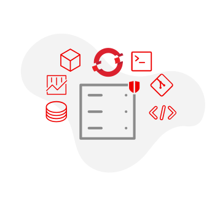

# Frontend Assets Icon Components

This file documents the generated React icon components and their usage with ScalprumComponent for dynamic loading.

## Usage

These components are designed to be used with ScalprumComponent for dynamic loading. They are not imported directly.

### Without PatternFly Wrapper (Preserves original SVG dimensions)
```tsx
<ScalprumComponent 
  scope="frontendAssets" 
  module="./ComponentName" 
  svgProps={{width: 50, height: 50}} 
/>
```

### With PatternFly Wrapper (Uses PatternFly Icon styling)
```tsx
<ScalprumComponent 
  scope="frontendAssets" 
  module="./ComponentName" 
  pfIconWrapper={true} 
  iconProps={{size: "lg"}} 
/>
```

### Combined Usage
```tsx
<ScalprumComponent 
  scope="frontendAssets" 
  module="./ComponentName" 
  pfIconWrapper={true}
  iconProps={{size: "md"}}
  svgProps={{className: "custom-icon-class"}} 
/>
```

## Props

All components accept the following props through ScalprumComponent:

- `pfIconWrapper?: boolean` - Whether to wrap the SVG in PatternFly's Icon component
- `iconProps?: IconComponentProps` - Props to pass to the PatternFly Icon wrapper (only used when pfIconWrapper is true)
- `svgProps?: React.SVGProps<SVGSVGElement>` - Props to pass directly to the SVG element

## Module Federation

These components are exposed through module federation with the scope `frontendAssets`. Each component can be loaded using its module name (e.g., `./ComponentName`).

## Component Mappings

| Preview | Component Name | Original SVG Name | Source SVG Path | Generated TSX Path |
|---|---|---|---|---|
|  | `AnsibleHubPartnerLogosArubaIcon` | `aruba.svg` | `/ansible-hub/partner-logos/aruba.svg` | `/ansible-hub/partner-logos/aruba.tsx` |
|  | `AnsibleHubPartnerLogosAvantraLogoStackedFullColoursIcon` | `Avantra-logo-stacked-full-colours.svg` | `/ansible-hub/partner-logos/Avantra-logo-stacked-full-colours.svg` | `/ansible-hub/partner-logos/Avantra-logo-stacked-full-colours.tsx` |
|  | `AnsibleHubPartnerLogosCohesityLogoIcon` | `cohesity_logo.svg` | `/ansible-hub/partner-logos/cohesity_logo.svg` | `/ansible-hub/partner-logos/cohesity_logo.tsx` |
|  | `AnsibleHubPartnerLogosCrowdstrikeLogoIcon` | `crowdstrike-logo.svg` | `/ansible-hub/partner-logos/crowdstrike-logo.svg` | `/ansible-hub/partner-logos/crowdstrike-logo.tsx` |
|  | `AnsibleHubPartnerLogosDefaultLogoIcon` | `default-logo.svg` | `/ansible-hub/partner-logos/default-logo.svg` | `/ansible-hub/partner-logos/default-logo.tsx` |
|  | `AnsibleHubPartnerLogosF5Icon` | `f5.svg` | `/ansible-hub/partner-logos/f5.svg` | `/ansible-hub/partner-logos/f5.tsx` |
|  | `AnsibleHubPartnerLogosFrroutingIcon` | `frrouting.svg` | `/ansible-hub/partner-logos/frrouting.svg` | `/ansible-hub/partner-logos/frrouting.tsx` |
|  | `AnsibleHubPartnerLogosJuniperNetworksLogoIcon` | `Juniper_Networks_logo.svg` | `/ansible-hub/partner-logos/Juniper_Networks_logo.svg` | `/ansible-hub/partner-logos/Juniper_Networks_logo.tsx` |
|  | `AnsibleHubPartnerLogosLogo2022Icon` | `logo2022.svg` | `/ansible-hub/partner-logos/logo2022.svg` | `/ansible-hub/partner-logos/logo2022.tsx` |
|  | `AnsibleHubPartnerLogosNetappIcon` | `netapp.svg` | `/ansible-hub/partner-logos/netapp.svg` | `/ansible-hub/partner-logos/netapp.tsx` |
|  | `AnsibleHubPartnerLogosNutanixLogoIcon` | `Nutanix_Logo.svg` | `/ansible-hub/partner-logos/Nutanix_Logo.svg` | `/ansible-hub/partner-logos/Nutanix_Logo.tsx` |
|  | `AnsibleHubPartnerLogosNvidiaLogoIcon` | `Nvidia_logo.svg` | `/ansible-hub/partner-logos/Nvidia_logo.svg` | `/ansible-hub/partner-logos/Nvidia_logo.tsx` |
|  | `AnsibleHubPartnerLogosOpensvcLogo2018Icon` | `opensvc-logo-2018.svg` | `/ansible-hub/partner-logos/opensvc-logo-2018.svg` | `/ansible-hub/partner-logos/opensvc-logo-2018.tsx` |
|  | `AnsibleHubPartnerLogosSensuIcon` | `sensu.svg` | `/ansible-hub/partner-logos/sensu.svg` | `/ansible-hub/partner-logos/sensu.tsx` |
|  | `AnsibleHubPartnerLogosVyosLogoIcon` | `vyos-logo.svg` | `/ansible-hub/partner-logos/vyos-logo.svg` | `/ansible-hub/partner-logos/vyos-logo.tsx` |
|  | `AskRedHatIconIcon` | `icon.svg` | `/ask-red-hat/icon.svg` | `/ask-red-hat/icon.tsx` |
|  | `BackgroundImagesBgHeroIcon` | `bg__hero.svg` | `/background-images/bg__hero.svg` | `/background-images/bg__hero.tsx` |
|  | `BackgroundImagesFedoraBackgroundIcon` | `fedora-background.svg` | `/background-images/fedora-background.svg` | `/background-images/fedora-background.tsx` |
|  | `BackgroundImagesFedoraBackgroundLeftIcon` | `fedora-background-left.svg` | `/background-images/fedora-background-left.svg` | `/background-images/fedora-background-left.tsx` |
|  | `BackgroundImagesImgCloudContainersIcon` | `img__cloud-containers.svg` | `/background-images/img__cloud-containers.svg` | `/background-images/img__cloud-containers.tsx` |
|  | `BackgroundImagesImgHybridCloudIcon` | `img__hybrid-cloud.svg` | `/background-images/img__hybrid-cloud.svg` | `/background-images/img__hybrid-cloud.tsx` |
|  | `ConsoleLandingAnsibleIcon` | `ansible.svg` | `/console-landing/ansible.svg` | `/console-landing/ansible.tsx` |
|  | `ConsoleLandingInsightsIcon` | `insights.svg` | `/console-landing/insights.svg` | `/console-landing/insights.tsx` |
|  | `ConsoleLandingOpenshiftIcon` | `openshift.svg` | `/console-landing/openshift.svg` | `/console-landing/openshift.tsx` |
|  | `ConsoleLandingWidgetExploreExploreCentOSToRHELIcon` | `Explore_CentOS-to-RHEL.svg` | `/console-landing/widget-explore/Explore_CentOS-to-RHEL.svg` | `/console-landing/widget-explore/Explore_CentOS-to-RHEL.tsx` |
|  | `ConsoleLandingWidgetExploreExploreInsightsAnalyzeIcon` | `Explore_Insights-analyze.svg` | `/console-landing/widget-explore/Explore_Insights-analyze.svg` | `/console-landing/widget-explore/Explore_Insights-analyze.tsx` |
|  | `ConsoleLandingWidgetExploreExploreSubsIcon` | `Explore_subs.svg` | `/console-landing/widget-explore/Explore_subs.svg` | `/console-landing/widget-explore/Explore_subs.tsx` |
|  | `ConsoleLandingWidgetExploreLogoHatOnlyIcon` | `logo_hat-only.svg` | `/console-landing/widget-explore/logo_hat-only.svg` | `/console-landing/widget-explore/logo_hat-only.tsx` |
|  | `ConsoleLandingWidgetExploreLogoRedHatAWSAStandardRGBIcon` | `Logo-Red_Hat-AWS-A-Standard-RGB.svg` | `/console-landing/widget-explore/Logo-Red_Hat-AWS-A-Standard-RGB.svg` | `/console-landing/widget-explore/Logo-Red_Hat-AWS-A-Standard-RGB.tsx` |
|  | `ConsoleLandingWidgetExploreLogoRedHatDeveloperAStandardRGBIcon` | `Logo-Red_Hat-Developer-A-Standard-RGB.svg` | `/console-landing/widget-explore/Logo-Red_Hat-Developer-A-Standard-RGB.svg` | `/console-landing/widget-explore/Logo-Red_Hat-Developer-A-Standard-RGB.tsx` |
|  | `ConsoleLandingWidgetExploreRocketIcon` | `rocket.svg` | `/console-landing/widget-explore/rocket.svg` | `/console-landing/widget-explore/rocket.tsx` |
|  | `ConsoleLogosLogoRedHatAStandardRGBIcon` | `Logo-Red_Hat-A-Standard-RGB.svg` | `/console-logos/Logo-Red_Hat-A-Standard-RGB.svg` | `/console-logos/Logo-Red_Hat-A-Standard-RGB.tsx` |
|  | `ConsoleLogosLogoRedHatHybridCloudConsoleABlackRGBIcon` | `Logo-Red_Hat-Hybrid_Cloud_Console-A-Black-RGB.svg` | `/console-logos/Logo-Red_Hat-Hybrid_Cloud_Console-A-Black-RGB.svg` | `/console-logos/Logo-Red_Hat-Hybrid_Cloud_Console-A-Black-RGB.tsx` |
|  | `ConsoleLogosLogoRedHatHybridCloudConsoleABlackRGBIcon` | `Logo-Red_Hat-Hybrid-Cloud-Console-A-Black-RGB.svg` | `/console-logos/Logo-Red_Hat-Hybrid-Cloud-Console-A-Black-RGB.svg` | `/console-logos/Logo-Red_Hat-Hybrid-Cloud-Console-A-Black-RGB.tsx` |
|  | `ConsoleLogosLogoRedHatHybridCloudConsoleARedRGBIcon` | `Logo-Red_Hat-Hybrid_Cloud_Console-A-Red-RGB.svg` | `/console-logos/Logo-Red_Hat-Hybrid_Cloud_Console-A-Red-RGB.svg` | `/console-logos/Logo-Red_Hat-Hybrid_Cloud_Console-A-Red-RGB.tsx` |
|  | `ConsoleLogosLogoRedHatHybridCloudConsoleARedRGBIcon` | `Logo-Red_Hat-Hybrid-Cloud-Console-A-Red-RGB.svg` | `/console-logos/Logo-Red_Hat-Hybrid-Cloud-Console-A-Red-RGB.svg` | `/console-logos/Logo-Red_Hat-Hybrid-Cloud-Console-A-Red-RGB.tsx` |
|  | `ConsoleLogosLogoRedHatHybridCloudConsoleAReverseRGBIcon` | `Logo-Red_Hat-Hybrid_Cloud_Console-A-Reverse-RGB.svg` | `/console-logos/Logo-Red_Hat-Hybrid_Cloud_Console-A-Reverse-RGB.svg` | `/console-logos/Logo-Red_Hat-Hybrid_Cloud_Console-A-Reverse-RGB.tsx` |
|  | `ConsoleLogosLogoRedHatHybridCloudConsoleAReverseRGBIcon` | `Logo-Red_Hat-Hybrid-Cloud-Console-A-Reverse-RGB.svg` | `/console-logos/Logo-Red_Hat-Hybrid-Cloud-Console-A-Reverse-RGB.svg` | `/console-logos/Logo-Red_Hat-Hybrid-Cloud-Console-A-Reverse-RGB.tsx` |
|  | `ConsoleLogosLogoRedHatHybridCloudConsoleAStandardRGBIcon` | `Logo-Red_Hat-Hybrid_Cloud_Console-A-Standard-RGB.svg` | `/console-logos/Logo-Red_Hat-Hybrid_Cloud_Console-A-Standard-RGB.svg` | `/console-logos/Logo-Red_Hat-Hybrid_Cloud_Console-A-Standard-RGB.tsx` |
|  | `ConsoleLogosLogoRedHatHybridCloudConsoleAStandardRGBIcon` | `Logo-Red_Hat-Hybrid-Cloud-Console-A-Standard-RGB.svg` | `/console-logos/Logo-Red_Hat-Hybrid-Cloud-Console-A-Standard-RGB.svg` | `/console-logos/Logo-Red_Hat-Hybrid-Cloud-Console-A-Standard-RGB.tsx` |
|  | `ConsoleLogosLogoRedHatHybridCloudConsoleAWhiteRGBIcon` | `Logo-Red_Hat-Hybrid_Cloud_Console-A-White-RGB.svg` | `/console-logos/Logo-Red_Hat-Hybrid_Cloud_Console-A-White-RGB.svg` | `/console-logos/Logo-Red_Hat-Hybrid_Cloud_Console-A-White-RGB.tsx` |
|  | `ConsoleLogosLogoRedHatHybridCloudConsoleAWhiteRGBIcon` | `Logo-Red_Hat-Hybrid-Cloud-Console-A-White-RGB.svg` | `/console-logos/Logo-Red_Hat-Hybrid-Cloud-Console-A-White-RGB.svg` | `/console-logos/Logo-Red_Hat-Hybrid-Cloud-Console-A-White-RGB.tsx` |
|  | `ConsoleLogosLogoRedHatHybridCloudConsoleBBlackRGBIcon` | `Logo-Red_Hat-Hybrid_Cloud_Console-B-Black-RGB.svg` | `/console-logos/Logo-Red_Hat-Hybrid_Cloud_Console-B-Black-RGB.svg` | `/console-logos/Logo-Red_Hat-Hybrid_Cloud_Console-B-Black-RGB.tsx` |
|  | `ConsoleLogosLogoRedHatHybridCloudConsoleBRedRGBIcon` | `Logo-Red_Hat-Hybrid_Cloud_Console-B-Red-RGB.svg` | `/console-logos/Logo-Red_Hat-Hybrid_Cloud_Console-B-Red-RGB.svg` | `/console-logos/Logo-Red_Hat-Hybrid_Cloud_Console-B-Red-RGB.tsx` |
|  | `ConsoleLogosLogoRedHatHybridCloudConsoleBReverseRGBIcon` | `Logo-Red_Hat-Hybrid_Cloud_Console-B-Reverse-RGB.svg` | `/console-logos/Logo-Red_Hat-Hybrid_Cloud_Console-B-Reverse-RGB.svg` | `/console-logos/Logo-Red_Hat-Hybrid_Cloud_Console-B-Reverse-RGB.tsx` |
|  | `ConsoleLogosLogoRedHatHybridCloudConsoleBStandardRGBIcon` | `Logo-Red_Hat-Hybrid_Cloud_Console-B-Standard-RGB.svg` | `/console-logos/Logo-Red_Hat-Hybrid_Cloud_Console-B-Standard-RGB.svg` | `/console-logos/Logo-Red_Hat-Hybrid_Cloud_Console-B-Standard-RGB.tsx` |
|  | `ConsoleLogosLogoRedHatHybridCloudConsoleBWhiteRGBIcon` | `Logo-Red_Hat-Hybrid_Cloud_Console-B-White-RGB.svg` | `/console-logos/Logo-Red_Hat-Hybrid_Cloud_Console-B-White-RGB.svg` | `/console-logos/Logo-Red_Hat-Hybrid_Cloud_Console-B-White-RGB.tsx` |
|  | `FavoritedservicesFavoritingEmptystateIcon` | `favoriting-emptystate.svg` | `/favoritedservices/favoriting-emptystate.svg` | `/favoritedservices/favoriting-emptystate.tsx` |
|  | `IconsIconAutomationIcon` | `icon__automation.svg` | `/icons/icon__automation.svg` | `/icons/icon__automation.tsx` |
|  | `IconsIconConstIcon` | `icon__const.svg` | `/icons/icon__const.svg` | `/icons/icon__const.tsx` |
|  | `IconsIconExpUpIcon` | `icon__exp-up.svg` | `/icons/icon__exp-up.svg` | `/icons/icon__exp-up.tsx` |
|  | `IconsIconSubscriptionsIcon` | `icon__subscriptions.svg` | `/icons/icon__subscriptions.svg` | `/icons/icon__subscriptions.tsx` |
|  | `IntegrationsIntegrationsWebhookIconIcon` | `integrations-webhook-icon.svg` | `/integrations/integrations-webhook-icon.svg` | `/integrations/integrations-webhook-icon.tsx` |
|  | `IntegrationsLandingIntegrationsLandingMinispotIcon` | `integrations-landing-minispot.svg` | `/integrations-landing/integrations-landing-minispot.svg` | `/integrations-landing/integrations-landing-minispot.tsx` |
|  | `IntegrationsLandingIntegrationsLandingWebhookIconIcon` | `integrations-landing-webhook-icon.svg` | `/integrations-landing/integrations-landing-webhook-icon.svg` | `/integrations-landing/integrations-landing-webhook-icon.tsx` |
|  | `LearningResourcesIamIcon` | `IAM.svg` | `/learning-resources/IAM.svg` | `/learning-resources/IAM.tsx` |
|  | `LearningResourcesLearningresourcesIcon` | `LearningResources.svg` | `/learning-resources/LearningResources.svg` | `/learning-resources/LearningResources.tsx` |
|  | `LearningResourcesRhelIconIcon` | `RHEL-icon.svg` | `/learning-resources/RHEL-icon.svg` | `/learning-resources/RHEL-icon.tsx` |
|  | `LearningResourcesRhIconIcon` | `RH-icon.svg` | `/learning-resources/RH-icon.svg` | `/learning-resources/RH-icon.tsx` |
|  | `LearningResourcesSettingsIcon` | `settings.svg` | `/learning-resources/settings.svg` | `/learning-resources/settings.tsx` |
|  | `LearningResourcesSubsIcon` | `subs.svg` | `/learning-resources/subs.svg` | `/learning-resources/subs.tsx` |
|  | `LogosLogoAnsibleAutomationIcon` | `logo__ansible-automation.svg` | `/logos/logo__ansible-automation.svg` | `/logos/logo__ansible-automation.tsx` |
|  | `LogosLogoApplicationServicesIcon` | `logo__application-services.svg` | `/logos/logo__application-services.svg` | `/logos/logo__application-services.tsx` |
|  | `LogosLogoInsightsIcon` | `logo__insights.svg` | `/logos/logo__insights.svg` | `/logos/logo__insights.tsx` |
|  | `LogosLogoOpenshiftIcon` | `logo__openshift.svg` | `/logos/logo__openshift.svg` | `/logos/logo__openshift.tsx` |
|  | `LogosLogoOsasIcon` | `logo__osas.svg` | `/logos/logo__osas.svg` | `/logos/logo__osas.tsx` |
|  | `LogosLogoRhelIcon` | `logo__rhel.svg` | `/logos/logo__rhel.svg` | `/logos/logo__rhel.tsx` |
|  | `LogosLogoSmartMgmtIcon` | `logo__smart-mgmt.svg` | `/logos/logo__smart-mgmt.svg` | `/logos/logo__smart-mgmt.tsx` |
|  | `PartnersIconsAwsIcon` | `aws.svg` | `/partners-icons/aws.svg` | `/partners-icons/aws.tsx` |
|  | `PartnersIconsAwsLongIcon` | `aws-long.svg` | `/partners-icons/aws-long.svg` | `/partners-icons/aws-long.tsx` |
|  | `PartnersIconsGoogleCloudIcon` | `google-cloud.svg` | `/partners-icons/google-cloud.svg` | `/partners-icons/google-cloud.tsx` |
|  | `PartnersIconsGoogleCloudShortIcon` | `google-cloud-short.svg` | `/partners-icons/google-cloud-short.svg` | `/partners-icons/google-cloud-short.tsx` |
|  | `PartnersIconsIbmCloudIcon` | `ibm-cloud.svg` | `/partners-icons/ibm-cloud.svg` | `/partners-icons/ibm-cloud.tsx` |
|  | `PartnersIconsLogoRedHatMarketplaceARedRGBIcon` | `Logo-Red_Hat-Marketplace-A-Red-RGB.svg` | `/partners-icons/Logo-Red_Hat-Marketplace-A-Red-RGB.svg` | `/partners-icons/Logo-Red_Hat-Marketplace-A-Red-RGB.tsx` |
|  | `PartnersIconsMicrosoftAzureIcon` | `microsoft-azure.svg` | `/partners-icons/microsoft-azure.svg` | `/partners-icons/microsoft-azure.tsx` |
|  | `PartnersIconsMicrosoftAzureShortIcon` | `microsoft-azure-short.svg` | `/partners-icons/microsoft-azure-short.svg` | `/partners-icons/microsoft-azure-short.tsx` |
|  | `PartnersIconsOracleCloudInfraIcon` | `oracle-cloud-infra.svg` | `/partners-icons/oracle-cloud-infra.svg` | `/partners-icons/oracle-cloud-infra.tsx` |
|  | `PartnersIconsOracleShortIcon` | `oracle-short.svg` | `/partners-icons/oracle-short.svg` | `/partners-icons/oracle-short.tsx` |
|  | `PartnersIconsVmwareIcon` | `vmware.svg` | `/partners-icons/vmware.svg` | `/partners-icons/vmware.tsx` |
|  | `PendoExclamationTriangleIcon` | `exclamation-triangle.svg` | `/pendo/exclamation-triangle.svg` | `/pendo/exclamation-triangle.tsx` |
|  | `PendoKafkalogoIcon` | `kafkalogo.svg` | `/pendo/kafkalogo.svg` | `/pendo/kafkalogo.tsx` |
|  | `PendoKafkatour1step1Icon` | `kafkatour1step1.svg` | `/pendo/kafkatour1step1.svg` | `/pendo/kafkatour1step1.tsx` |
|  | `PendoKafkatour1step2Icon` | `kafkatour1step2.svg` | `/pendo/kafkatour1step2.svg` | `/pendo/kafkatour1step2.tsx` |
|  | `PendoKafkatour2step1Icon` | `kafkatour2step1.svg` | `/pendo/kafkatour2step1.svg` | `/pendo/kafkatour2step1.tsx` |
|  | `PendoKafkatour2step2Icon` | `kafkatour2step2.svg` | `/pendo/kafkatour2step2.svg` | `/pendo/kafkatour2step2.tsx` |
|  | `PendoOcmExpirationIcon` | `ocm-expiration.svg` | `/pendo/ocm-expiration.svg` | `/pendo/ocm-expiration.tsx` |
|  | `PendoOcmOcpIcon` | `ocm-ocp.svg` | `/pendo/ocm-ocp.svg` | `/pendo/ocm-ocp.tsx` |
|  | `PendoOcmOsdIcon` | `ocm-osd.svg` | `/pendo/ocm-osd.svg` | `/pendo/ocm-osd.tsx` |
|  | `PendoPic1Icon` | `Pic1.svg` | `/pendo/Pic1.svg` | `/pendo/Pic1.tsx` |
|  | `PendoPic2Icon` | `Pic2.svg` | `/pendo/Pic2.svg` | `/pendo/Pic2.tsx` |
|  | `PendoPic3Icon` | `Pic3.svg` | `/pendo/Pic3.svg` | `/pendo/Pic3.tsx` |
|  | `PendoPic4Icon` | `Pic4.svg` | `/pendo/Pic4.svg` | `/pendo/Pic4.tsx` |
|  | `PlatformIconsFaqButtonIcon` | `faq-button.svg` | `/platform-icons/faq-button.svg` | `/platform-icons/faq-button.tsx` |
|  | `PlatformIconsFeedbackIlloIcon` | `feedback_illo.svg` | `/platform-icons/feedback_illo.svg` | `/platform-icons/feedback_illo.tsx` |
|  | `PlatformIconsHomeIcon` | `home.svg` | `/platform-icons/home.svg` | `/platform-icons/home.tsx` |
|  | `PlatformIconsHourglassMinispotIcon` | `Hourglass-Minispot.svg` | `/platform-icons/Hourglass-Minispot.svg` | `/platform-icons/Hourglass-Minispot.tsx` |
|  | `PlatformIconsImgAvatarIcon` | `img_avatar.svg` | `/platform-icons/img_avatar.svg` | `/platform-icons/img_avatar.tsx` |
|  | `PlatformIconsNavExpandChevronIcon` | `nav-expand-chevron.svg` | `/platform-icons/nav-expand-chevron.svg` | `/platform-icons/nav-expand-chevron.tsx` |
|  | `PlatformIconsOverflowActionsLgIcon` | `overflow-actions-lg.svg` | `/platform-icons/overflow-actions-lg.svg` | `/platform-icons/overflow-actions-lg.tsx` |
|  | `PlatformIconsOverflowActionsSmIcon` | `overflow-actions-sm.svg` | `/platform-icons/overflow-actions-sm.svg` | `/platform-icons/overflow-actions-sm.tsx` |
|  | `PlatformIconsPrimaryNavHamburgerToggleIcon` | `primary-nav-hamburger-toggle.svg` | `/platform-icons/primary-nav-hamburger-toggle.svg` | `/platform-icons/primary-nav-hamburger-toggle.tsx` |
|  | `PlatformIconsSettingsButtonIcon` | `settings-button.svg` | `/platform-icons/settings-button.svg` | `/platform-icons/settings-button.tsx` |
|  | `PlatformLogosAnsibleAutomationPlatformIcon` | `ansible-automation-platform.svg` | `/platform-logos/ansible-automation-platform.svg` | `/platform-logos/ansible-automation-platform.tsx` |
|  | `PlatformLogosAnsibleIcon` | `ansible.svg` | `/platform-logos/ansible.svg` | `/platform-logos/ansible.tsx` |
|  | `PlatformLogosAnsibleTowerIcon` | `ansible-tower.svg` | `/platform-logos/ansible-tower.svg` | `/platform-logos/ansible-tower.tsx` |
|  | `PlatformLogosAnsibleTowerRedIcon` | `ansible-tower-red.svg` | `/platform-logos/ansible-tower-red.svg` | `/platform-logos/ansible-tower-red.tsx` |
|  | `PlatformLogosCostManagementIcon` | `cost-management.svg` | `/platform-logos/cost-management.svg` | `/platform-logos/cost-management.tsx` |
|  | `PlatformLogosHcmNamespaceIcon` | `hcm-namespace.svg` | `/platform-logos/hcm-namespace.svg` | `/platform-logos/hcm-namespace.tsx` |
|  | `PlatformLogosInsightsIcon` | `Insights.svg` | `/platform-logos/Insights.svg` | `/platform-logos/Insights.tsx` |
|  | `PlatformLogosMigrationsNamespaceIcon` | `migrations-namespace.svg` | `/platform-logos/migrations-namespace.svg` | `/platform-logos/migrations-namespace.tsx` |
|  | `PlatformLogosOpenshiftContainerPlatformIcon` | `openshift-container-platform.svg` | `/platform-logos/openshift-container-platform.svg` | `/platform-logos/openshift-container-platform.tsx` |
|  | `PlatformLogosOpenshiftIcon` | `openshift.svg` | `/platform-logos/openshift.svg` | `/platform-logos/openshift.tsx` |
|  | `PlatformLogosOpenstackIcon` | `openstack.svg` | `/platform-logos/openstack.svg` | `/platform-logos/openstack.tsx` |
|  | `PlatformLogosOvirtIcon` | `ovirt.svg` | `/platform-logos/ovirt.svg` | `/platform-logos/ovirt.tsx` |
|  | `PlatformLogosRhelCsNamespaceIcon` | `rhel-cs-namespace.svg` | `/platform-logos/rhel-cs-namespace.svg` | `/platform-logos/rhel-cs-namespace.tsx` |
|  | `PlatformLogosSatelliteIcon` | `satellite.svg` | `/platform-logos/satellite.svg` | `/platform-logos/satellite.tsx` |
|  | `RbacLandingRbacLandingIconIcon` | `rbac-landing-icon.svg` | `/rbac-landing/rbac-landing-icon.svg` | `/rbac-landing/rbac-landing-icon.tsx` |
|  | `RbacLandingRbacLandingMinispotIcon` | `rbac-landing-minispot.svg` | `/rbac-landing/rbac-landing-minispot.svg` | `/rbac-landing/rbac-landing-minispot.tsx` |
|  | `RbacLandingWorkspacesBindingsIconIcon` | `workspaces-bindings-icon.svg` | `/rbac-landing/workspaces-bindings-icon.svg` | `/rbac-landing/workspaces-bindings-icon.tsx` |
|  | `RbacLandingWorkspacesRolesIconIcon` | `workspaces-roles-icon.svg` | `/rbac-landing/workspaces-roles-icon.svg` | `/rbac-landing/workspaces-roles-icon.tsx` |
|  | `RedHatLogosLogoHatOnlyIcon` | `logo_hat-only.svg` | `/red-hat-logos/logo_hat-only.svg` | `/red-hat-logos/logo_hat-only.tsx` |
|  | `RedHatLogosLogoIcon` | `logo.svg` | `/red-hat-logos/logo.svg` | `/red-hat-logos/logo.tsx` |
|  | `RedHatLogosStackedIcon` | `stacked.svg` | `/red-hat-logos/stacked.svg` | `/red-hat-logos/stacked.tsx` |
|  | `SourcesIntegrationsAnsibleIcon` | `ansible.svg` | `/sources-integrations/ansible.svg` | `/sources-integrations/ansible.tsx` |
|  | `SourcesIntegrationsGoogleChatIcon` | `google-chat.svg` | `/sources-integrations/google-chat.svg` | `/sources-integrations/google-chat.tsx` |
|  | `SourcesIntegrationsIntegrationsIconIcon` | `integrations-icon.svg` | `/sources-integrations/integrations-icon.svg` | `/sources-integrations/integrations-icon.tsx` |
|  | `SourcesIntegrationsMicrosoftOfficeTeamsIcon` | `microsoft-office-teams.svg` | `/sources-integrations/microsoft-office-teams.svg` | `/sources-integrations/microsoft-office-teams.tsx` |
|  | `SourcesIntegrationsPagerdutyIcon` | `pagerduty.svg` | `/sources-integrations/pagerduty.svg` | `/sources-integrations/pagerduty.tsx` |
|  | `SourcesIntegrationsPagerdutyWidget2Icon` | `pagerduty-widget2.svg` | `/sources-integrations/pagerduty-widget2.svg` | `/sources-integrations/pagerduty-widget2.tsx` |
|  | `SourcesIntegrationsPagerdutyWidgetIcon` | `pagerduty-widget.svg` | `/sources-integrations/pagerduty-widget.svg` | `/sources-integrations/pagerduty-widget.tsx` |
|  | `SourcesIntegrationsServiceNowIcon` | `service-now.svg` | `/sources-integrations/service-now.svg` | `/sources-integrations/service-now.tsx` |
|  | `SourcesIntegrationsSlackIcon` | `slack.svg` | `/sources-integrations/slack.svg` | `/sources-integrations/slack.tsx` |
|  | `SourcesIntegrationsSplunkIcon` | `splunk.svg` | `/sources-integrations/splunk.svg` | `/sources-integrations/splunk.tsx` |

## Generated Components

Total components generated: 133
